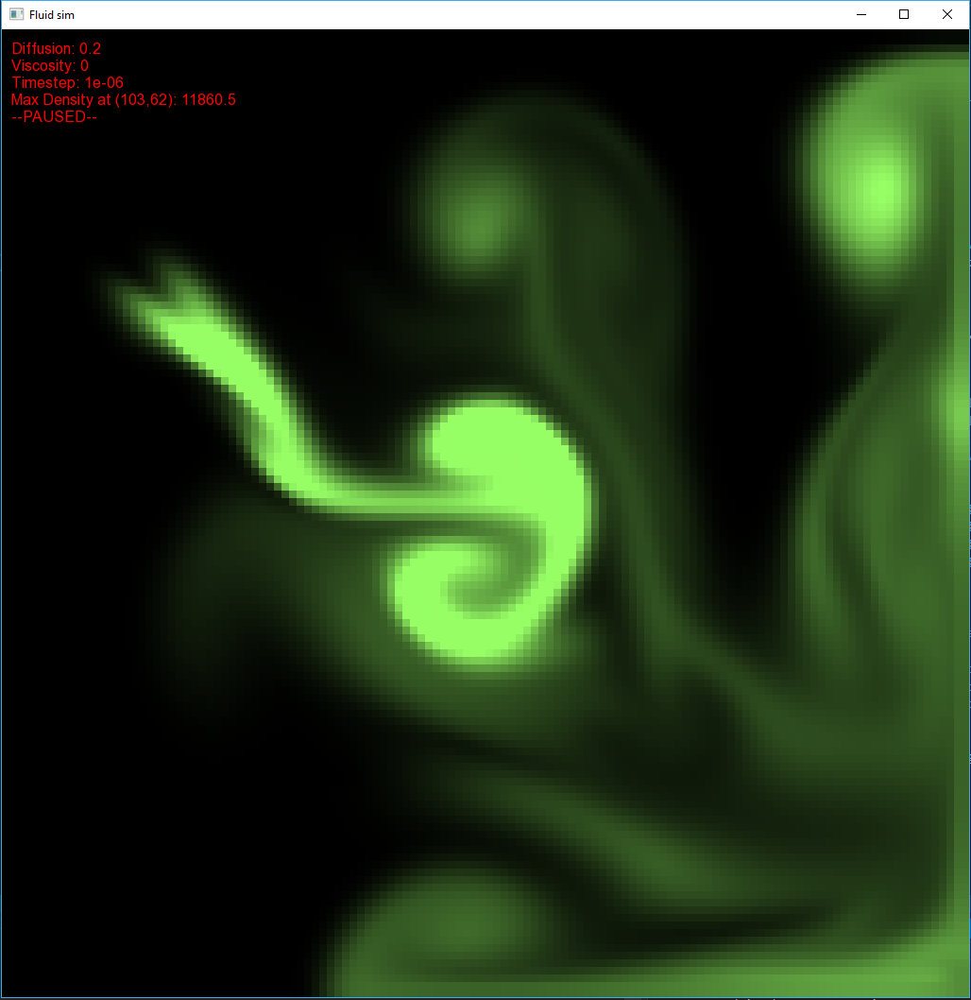

# fluid_sim_sfml
An interactive fluid simulation based on the Navier-Stokes equations



# USAGE
## Adding fluid
To add fluid, press TAB+Right clic and drag the mouse to add fluid to the fluid domain.
## Adding velocity
To add velocity, use the mouse right clic and drag.

## CHANGE FLUID COLORS
For now, changing the fluid color can be done by editing the following method FluidDomain::renderAsRect() in **FluidDomain.cpp**:
```cpp
FluidDomain::renderAsRect() {
	for (int i = 0; i < N; i++) {
		for (int j = 0; j < N; j++) {
			float d = _fluidSim->_density[XY(i, j)];
			_maxd = max(d, _maxd);
			float h_d = min(d, 200.f);
			float h_d3 = min(d, 500.f);
			float h_d2 = min(d, 10000.f);
                        //Change render color here (colors are in HSV)
			sf::Color rgb = hsv2rgb(100 + 12 * (h_d2 / 10000.f), 0.6f, h_d3 / 500.f);
			_rectMap[XY(i, j)].setFillColor(rgb);
		}
	}
}
```
The colors are in the HSV format. For example, to change the color to red, change the sf::Color line to the following:
```cpp
sf::Color rgb = hsv2rgb(360, 0.6f, h_d3 / 500.f); //360 is the hue value for red
```

# HOW IT WORKS
In this fluid simulation, each cell contains a velocity and density. Each call to the function ```fluid.step()``` calculates the velocity and density fields which satisfy the following two equations:


The first equation determines the movement of the velocity field, and the second determines the movement of the density field.
## Velocity Diffusion
The second term in the Navier-Stokes equations determines diffusion in the fluid. The first step of the simulation is the diffusion of velocity values. The diffusion step calculates how the simulated fluid moves in order to satisfy this term. An iterative Gauss-Seidel solver in the ```lin_solve()``` function finds the solution. This function is applied to each velocity component.
The solver generates solutions which do not respect conservation of mass within the fluid. A second function, ```project()```, which also uses a Gauss-Seidel solver, is applied to transform the velocity field into one which respects conservation of mass.
## Velocity Advection
The velocity field determines the movement of the fluid. The advection step applies the velocity field to the fluid in order to calculate this movement. It’s necessary to apply the velocity field to the density field and also to the velocity field itself. The function ```advect()``` examines the velocity in each cell and determines updates the cell’s contents according to the velocity it finds and the values of the surrounding cells.
## Density Diffusion and Advection
After determining the movement of the velocity field, the simulation then determines the movement of the density field. The same functions, ```diffuse()``` and ```advect()```, are used on the density field to determine its new state.

# IMPORTANT
SFML is required to compile this project. You can get it here: https://www.sfml-dev.org/download.php
This work is based on the thesis of *Michael Ash* https://www.mikeash.com/thesis/thesis-en.pdf

Enjoy this little project as you see fit, and feel free to contact me!

Email: slimlimem@gmail.com Linkedin: https://www.linkedin.com/in/slim-limem/
